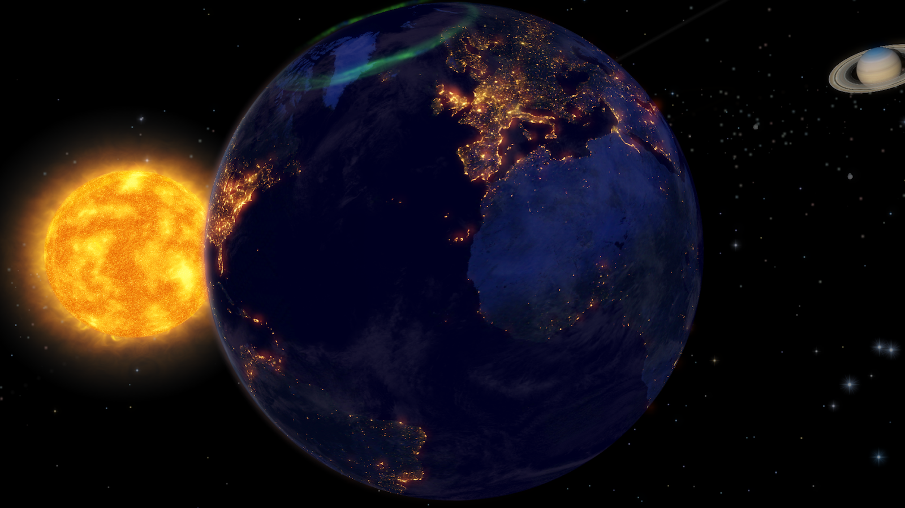

> “因為萬有都是靠他造的，無論是天上的，地上的；能看見的，不能看見的；或是有位的，主治的，執政的，掌權的；一概都是藉着他造的，又是為他造的。  
“for all things in heaven and on earth were created by him – all things, whether visible or invisible, whether thrones or dominions, whether principalities or powers – all things were created through him and for him.”  
**歌羅西書 1:16 CUNP-神**  
  
  
这里讲到了神创造的大工，经文说万有的创造都是本于耶稣，也是为耶稣而造的。无论是天上地上我们所能看见的一切，还有我们所不能看见的灵界，甚至充满能力的天使们，都是为他所造。  
这是一个何等壮阔的图景，天上的星辰的辽阔，地上的山川的壮美，无一不在诉说神精确美妙的设计，无一不在向我们展示神伟大而细致的工作。🌏🌞  

我们常常感叹大自然如此美丽，这自然的背后，不就是神亲手的创作么？  

这段时间总是忙于各样眼前的事务，应对当下的压力，面对各种对未来的未知，焦头烂额，绝少时间能跳出自己的小小的眼界，来看神的大能。有如此一位铺设穹苍，雕琢大地的上帝作我们的后盾和膀臂，神也应许我们说，我们岂不比这花花草草，这鸟儿走兽，贵重许多吗？神如此的妆饰和供应它们，岂不是把更多的丰富和满足，赐予我们这些归入祂名下，被称为祂儿女的人吗？  
那么，我们到底还在焦虑什么，畏惧什么呢？  

神为他的爱子耶稣创造了一切，而这一位神所挚爱的爱子，却为了人类的罪，承受了所有的屈辱、背叛和苦楚，为我们死在了十字架上……  
想到这里，唯觉感激涕零，无以为报。  
有如此大能可靠的神，我们只当把未来交在祂的手中，然后竭力的按着祂的吩咐，奔行我们前方的路程，就可以了。🐾  

本应如此……  

上周都各种东搞西搞，偷懒了好几天，深觉得自己也是力量不足，挺需要大家的代祷支持的，恩也感谢各位弟兄姊一路走来毫不嫌弃（或者嫌弃了没好意思讲😂），恩不管怎样，我们都需要互相的鼓励，各位要有什么需要代祷的也都可以留言告诉我，我会为各位祷告的。  
爆肝了一周，周末的时候也是非常感谢神给予了一个特别的恩典，很受滋养。  
非常的感谢神，接下来我们也大家一起，继续努力~  
  
耶稣爱你~💜  
晚安✨  