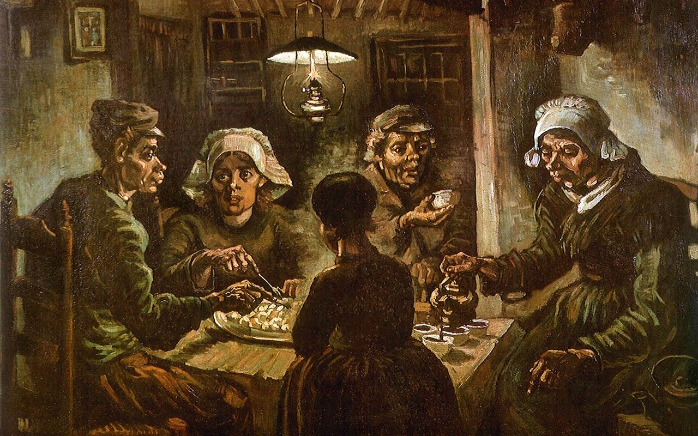

 

> “我為主被囚的勸你們：既然蒙召，行事為人就當與蒙召的恩相稱。凡事謙虛、溫柔、忍耐，用愛心互相寬容，用和平彼此聯絡，竭力保守聖靈所賜合而為一的心。  
“I, therefore, the prisoner for the Lord, urge you to live worthily of the calling with which you have been called, with all humility and gentleness, with patience, bearing with one another in love, making every effort to keep the unity of the Spirit in the bond of peace.”  
**以弗所書 4:1-3 CUNP-神**  

保罗的书信，一直都比较关注教会的事宜，以弗所书是里面讲述教会，也就是基督的身体，最完整的一卷书，在新约中和罗马书都算是非常深奥的书卷。这一段经文就主要讲到了教会里弟兄姊妹们的关系。❤️  

前几天听蒋勋老师讲解了梵高的早期画作《吃马铃薯的人》，就是上面这幅画。描述的就是几个黑黑瘦瘦，其貌不扬的农民，在一个简陋无法遮风的房子里，就着一盏煤油灯，分享他们的晚餐，一盘马铃薯和黑咖啡的场景。  
据梵高的书信里记载，他白天看到这几个农民在田地里用手指来挖出地里的马铃薯。晚上就从他们满是破洞的墙壁上，见到他们正在用晚餐，而唯一的食物，就是他们白天亲手劳作而得到的这为数不多的马铃薯。这食物实在比较简单，似乎也不太够让五人吃饱，画中负责分配食物的男女主人也面露难色，从他们都蜷缩着的动作看来，这屋子似乎也并不能遮挡外面的寒风，所以他们需要这为数不多的食物和黑咖啡来给他们提供温暖。  
梵高的记载也提到说，虽然是如此少的食物，如此简陋的屋子，他们在用餐前也非常认真的向神祈祷，感谢神一天的赐予的供应，分配食物的时候，也都是彼此照顾，互相扶持，虽然有对现实的无奈，但也并没有互相的埋怨和争端，小小破破的一个屋子里，却有从神而来的盼望和平安。🌟  

听到这里的时候，不由得非常动容。  

虽然马洛斯需求金字塔提到说，生存和温饱是人一切行为的基础，现今的社会也是如此，大家为了利益，为了产业，为了升迁的机会，各种勾心斗角，彼此恨恶，甚至打得头破血流……🎭  
但是神让我们看到了，我们的供应来自于祂，我们需要做的，是把这些恩典分享开来，凡事谦虚温柔忍耐，彼此相爱，互相宽容，也在主里，用和平彼此联络。  

圣灵已经赐给我们合而为一的心，其实我们就是非常真实的家人。也许和一些弟兄姊妹第一次见面，或者并不熟悉，但因为主的爱已经把我们联合起来，我们同样可以大家互相信任，彼此相爱。🌷  
也许我们现在做得还不够，还不够的谦虚，不够温柔，不够忍耐宽容，互相之间的联络和爱心也不够，也许还会有一些小争端，但是，既然 **圣灵已经给了我们合而为一的心** 了，那我们可以从现在开始，互相的问候，互相关心，互相代祷，互相扶持，我们做不到的，上帝可以给我们力量，弟兄姊妹们也可以帮助我们，那我们就一起来，共同走这条天路。🐾  
  
又是一个美丽清晨，让我们一起来迎接神所赐予的新的一天☀️  
早安🌻  
上帝爱你，我也爱你~💜  